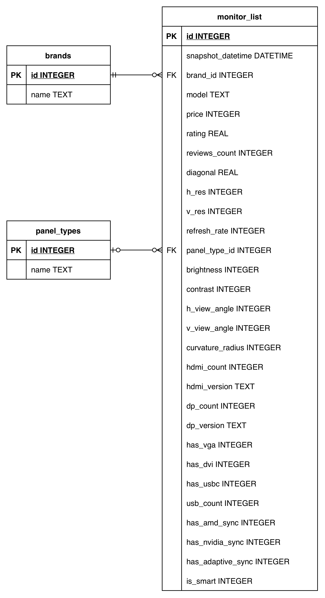
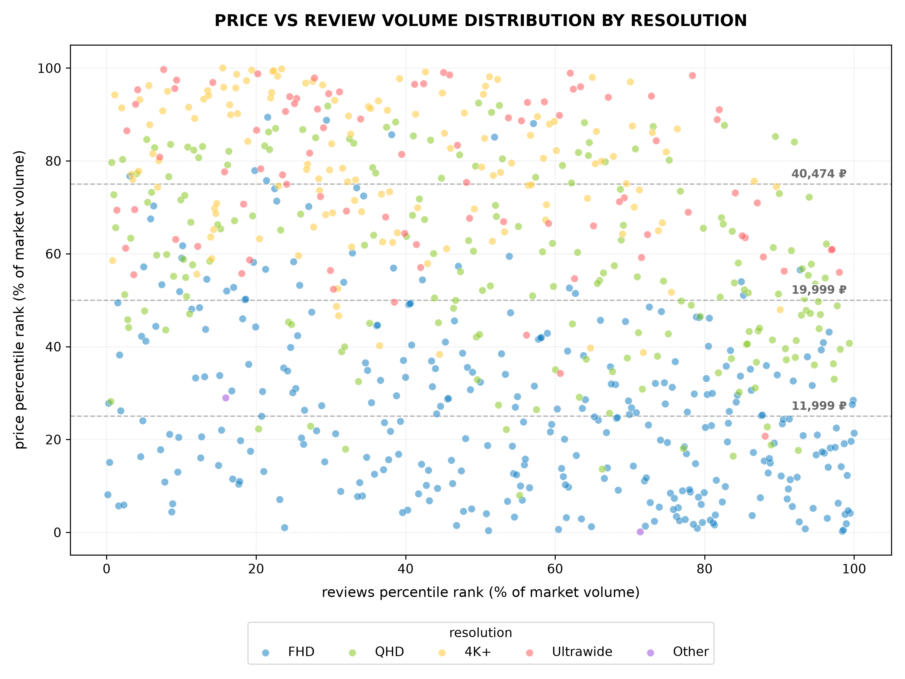
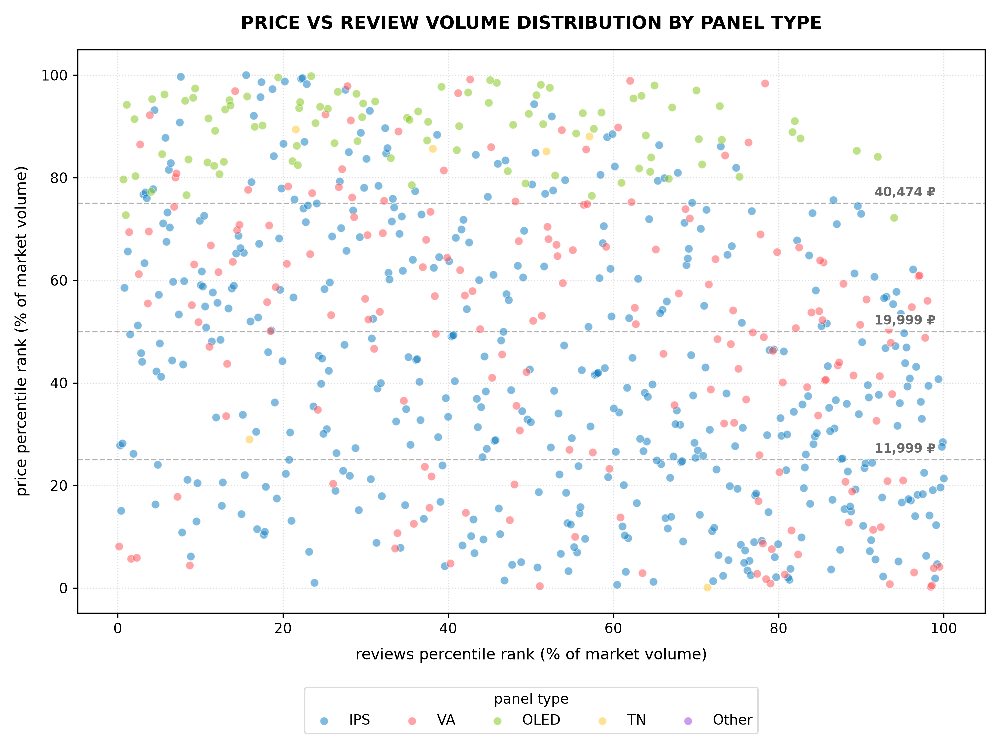
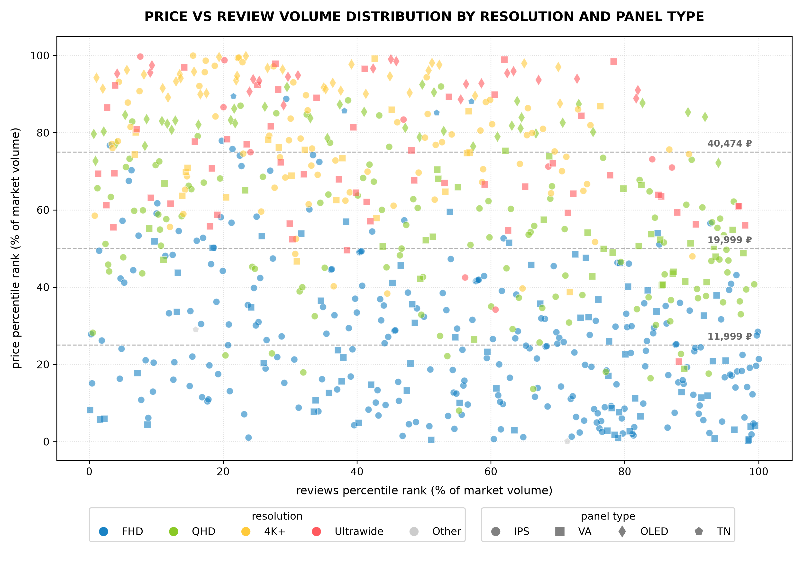
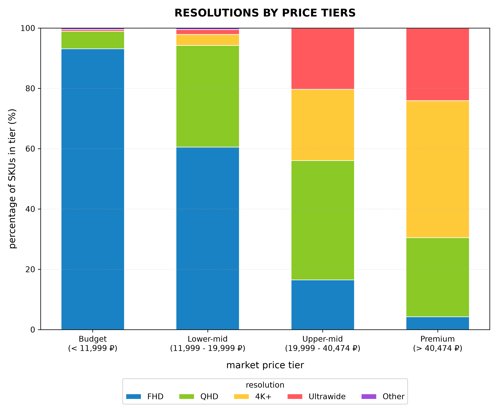
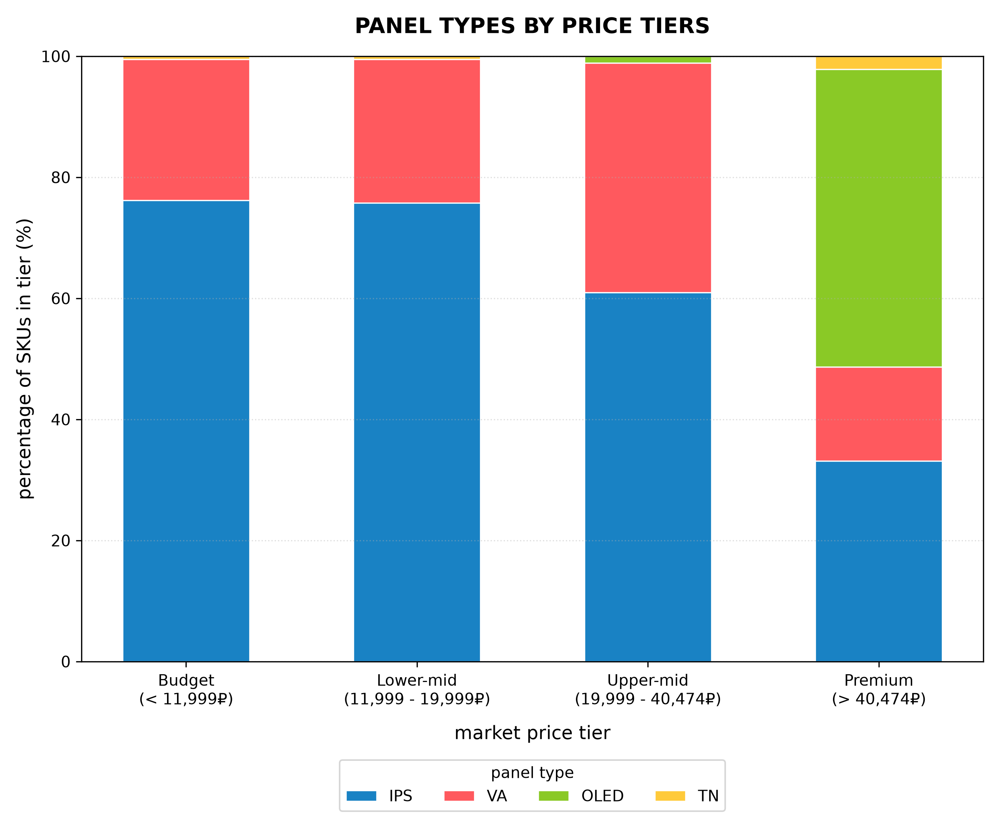
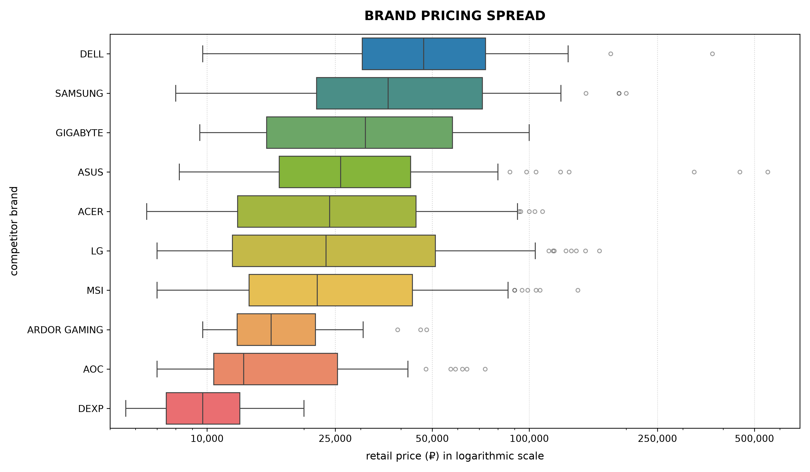

# E-Commerce Market Intelligence: Monitors

<small>Этот репозиторий защищён лицензией **CC BY-NC 4.0**.<small>

> <small><b>Язык:</b> Русский | <a href="README.md">Read in English</a></small>

## О чём проект
Этот проект имитирует корпоративный процесс сбора и анализа рыночной информации на основе данных о розничных предложениях (характеристики, цены, количество отзывов и рейтинги покупателей) от крупного ритейлера электроники. Для демонстрации высокого уровня технической компетентности я разработал надёжную схему реляционной базы данных (ERD), выполнил её развертывание с помощью DDL SQL запросов внутри скрипта Python, а также создал VIEW для преобразования реляционных данных в плоскую табличную структуру, удобную для экспорта.

## Почему мониторы
Почему я выбрал именно мониторы? Мониторы идеально подходят для анализа данных, поскольку обеспечивают оптимальное сочетание аналитических параметров. Здесь коммерческие характеристики (название бренда, рейтинги, объем отзывов, цена) накладываются на конкретные технические спецификации (разрешение, тип матрицы, частота обновления, углы обзора, интерфейсы подключения).

Это позволяет классифицировать данные по ключевым бизнес-категориям (рыночное позиционирование, осязаемые характеристики, интерфейсы ввода-вывода) и провести глубокий многофакторный анализ, выходящий за рамки простого отслеживания цен. Выбор пал на оранжевый магазин электроники благодаря разнообразию/широте каталога и фильтров, что позволило сформировать качественный массив данных для этого среза.

## Технологический стек
* Архитектура БД: библиотека sqlite3, проектирование диаграммы «сущность-связь» (ERD), нормализация реляционной БД, использование SQL-представлений (VIEW) для денормализации
* Анализ данных: Python, pandas (ценовая сегментация на основе квантилей, ранжирование по перцентилям для учёта асимметрии распределения)
* Визуализация данных: Matplotlib и Seaborn (создание наглядных бизнес-графиков, соблюдение цветовой палитры, устранение избыточных визуальных элементов)

## Порядок
Проект разбит на последовательные скрипты, отражающие профессиональный рабочий процесс ETL и аналитики:
* ```1_db_creation.py``` для создания базы данных SQLite
* ```2_db_insert.py``` для загрузки данных из файла csv (снимка данных) в базу данных
* ```3_export_flat_csv.py``` для экспорта данных из SQL-представления (VIEW) в плоский файл csv, готовый к анализу
* ```4_pandas_analysis.py``` для проведения исследовательского анализа данных
* ```5_price_reviews_panel_types_scatter.py``` и ```5_price_reviews_resolution_scatter.py``` для построение диаграмм рассеяния, отображающих рыночную востребованность в зависимости от цены на основе перцентильных распределений
* ```6_panel_types_stacked.py``` и ```6_resolution_stacked.py``` для построения нормированных гистограмм для определения базовых ожиданий относительно характеристик в четырёх ценовых сегментах (бюджетный, нижний средний, верхний средний, премиальный)

## ERD
Для базы данных я спроектировал реляционную схему, обеспечивающую баланс между целостностью данных и простотой выполнения запросов:
* Нормализованные категории (3NF): категориальные метаданные (бренды и типы панелей) хранятся в отдельных таблицах. Это устраняет дублирование строковых значений, позволяет обрабатывать опечатки и вариации названий, возникающие при сборе данных, а также упрощает работу с внешними ключами.
* Плоская структура технических характеристик: основные технические параметры хранятся непосредственно в главной таблице мониторов. Поскольку это неизменяемые атрибуты конкретной модели, их хранение в основной таблице позволяет избежать избыточной нормализации и лишних операций соединения таблиц.
* Типы данных и стандарты времени: типы столбцов соответствуют характеристикам хранимых данных:
  * INTEGER: для хранения конкретных параметров монитора (например, количества пикселей, частоты обновления, яркости и т.д.), цен и логических флагов (в виде 0 или 1)
  * REAL: для хранения десятичных значений, таких как диагональ монитора (в дюймах) и потребительские рейтинги
  * TEXT: для хранения названий моделей и брендов, типов панелей и версий интерфейсов HDMI/DisplayPort
  * DATETIME: для хранения временных меток (snapshot_datetime) в формате ISO 8601 (ГГГГ-ММ-ДД ЧЧ:ММ:СС), что обеспечивает возможность хронологической сортировки в SQL запросах и корректного парсинга в pandas с помощью функции pd.to_datetime()

<details>
<summary><b>Нажмите, чтобы открыть ERD</b></summary>



</details>

## Анализ

<details>
<summary><b>Нажмите, чтобы открыть вывод 4_pandas_analysis.py</b></summary>

```
===================================================================
SNAPSHOT COMPARISON: 2026-09-26 vs 2026-08-01
===================================================================
Total entries in previous snapshot: 799
Total entries in latest snapshot:   748
Net change in total entries:        -51
New models introduced:              172
Models removed:                     216
Models retained across both dates:  554

===================================================================
CHRONOLOGICAL MARKET TRENDS
===================================================================
> MEDIAN MARKET PRICE OVER TIME <
snapshot_date
2026-08-01    19999.0
2026-09-26    19999.0
Name: price, dtype: float64 

> AMD SYNC VS NVIDIA SYNC <
               amd_sync_share_pct  nvidia_sync_share_pct
snapshot_date                                           
2026-08-01                   54.1                   23.2
2026-09-26                   54.9                   23.9 

> PANEL TYPE SHARE DISTRIBUTION OVER TIME <
panel_type      IPS    VA  OLED   TN  QD-OLED
snapshot_date                                
2026-08-01     63.6  24.2  11.6  0.6      0.0
2026-09-26     61.7  24.9  12.4  0.8      0.1 

===================================================================
CURRENT MARKET ANALYSIS FOR 2026-09-26 SNAPSHOT
===================================================================
> PRICE SEGMENTATION <
                        min     max   median  count
price_tier                                         
Budget (Bottom 25%)    4999   11999   9799.0    189
Lower-mid (25-50%)    12199   19999  15999.0    190
Upper-mid (50-75%)    20199   40299  27999.0    182
Premium (Top 25%)     40999  549999  69999.0    187 

> TOP 10 BRANDS BY MARKET PRESENCE <
              listings_count  median_price  total_reviews
brand                                                    
Acer                     103       23999.0           3134
MSI                       99       21999.0          19266
ASUS                      83       24999.0           6673
LG                        70       23399.0           7501
Samsung                   68       36499.0           7761
AOC                       45       12999.0           3429
ARDOR GAMING              41       15799.0          36330
Dell                      40       47049.0            236
DEXP                      32        9699.0          13875
Machenike                 21       16999.0           2072 

> HARDWARE FEATURE PENETRATION <
High refresh rate (144Hz+):  63.24% of market
USB-C connectivity:          22.99% of market
Curved screens:              20.45% of market
4K resolution:               16.98% of market

> PRICE BY RESOLUTION <
                 median  count
resolution_str                
1920x1080       11999.0    329
2560x1440       24999.0    196
3840x2160       45999.0    127
3440x1440       33999.0     59
5120x1440       94499.0     14 

> PRICE BY SCREEN SIZE <
                       median  count
size_tier                           
Compact (<24")        10499.0    155
Mainstream (24"-27")  18999.0    400
Large (>27")          40299.0    193 

> PRICE BY PANEL TYPE <
             median  count
panel_type                
IPS         15999.0    461
VA          21499.0    186
QD-OLED     53999.0      1
TN          62999.0      6
OLED        83999.0     93 

> SPECIFIC FEATURE PREMIUMS <
Curved screen markup:   28,199₽ (Curved) vs 17,799₽ (Flat)
Gaming (144Hz+) markup: 22,199₽ (Gaming) vs 15,999₽ (Standard)
```

</details>

### Price and review volume distribution by resolution (percentiles)


This chart shows us every monitor SKU on DNS website from the recent snapshot (this one in particular is from September 26, 2026).
The easiest way to describe how to read this chart is higher = more expensive, lower = less expensive, to the right = more reviews, to the left = less reviews. Dots represent what resolution it is, I have decided to divide it into Full HD (FHD/1080p), Quad HD (QHD/1440p), 4K or higher (4K+), Ultrawide (wider that 16:9), and other.
The chart indicates several things:
* The chart is denser in the "lower price, more reviews" and "higher price, less reviews", and the corner with "higher price, more reviews" is relatively empty, so, like, basic stuff – people mostly buy cheaper monitors (the status of the store itself most likely influences that as well, but it is out of the scope)
* The budget category (below 11999₽) is dominated by 1080p monitors
* The lower-mid category (11999-19999₽) is mostly populated by 1080p and 1440p monitors, with some inclusions of ultrawide and 4k monitors
* The upper-mid category (19999-40474₽) consists of mostly 1440p, 4K+ and ultrawide monitors, but 1080p is also still there, but it gets way less reviews than the higher resolution monitors
* And, finally, the premium category (above 40474₽) gets less reviews in general, with only a handful of monitors sitting above 80th reviews percentile, and most expensive being 4K+ and ultrawide monitors


### Price and review volume distribution by panel types (percentiles)


This chart shows the same axis, with the same monitors being in the same places, but now the colors of the dots indicate the panel types of the monitors.
There are 4 types of monitor panels here: IPS, VA, OLED, TN.
This chart indicates:
* That budget, lower-mid and upper-mid is almost equally dominated by monitors with IPS and VA panels
* TN is almost nonexistent and is either present at the pricing bottom or in premium category for some reason (perhaps some niche gaming monitors?)
* OLED is strictly in premium (it is almost perfectly sits above the dividing line), but there are models in the "more reviews" zone, so there is definitely a market for them, especially considering that quality and factory yields have improved in recent years


### Price and review volume distribution by resolution and panel types (percentiles)


I'm not sure if this chart is readable/legible so I am including it as an extra.
* The TN monitors in premium are 1080p ones (now I'm really curious what they are, might check out later), and at the bottom – "other", which, given the pricing, means low resolution
* It seems that all OLED monitors are above 1080p (could not spot a single blue rhombus), but most reviewed being 1440p ones, which makes sense considering that 4K+ and ultrawide OLED monitors sitting higher (= expensive) are (surprise) more expensive
* Budget is mostly composed of 1080p IPS and VA monitors, as already seen from previous graphs, so nothing new here
* Most ultrawide monitors sit in upper-mid and premium categories, and most of them in upper-mid are VA, and OLED ultrawides are mostly in the most expensive section, and the IPS ultrawides are very scarce


### Resolution by price tiers


Here we can see more precisely how each pricing tier is populated in regards to monitor resolution. Good luck getting 4K or even 1440p if you are in the budget category – more than 90% is 1080p. And in lower-mid there is much more choice – more than 30% is populated by 1440p, and there are even some 4K and ultrawide monitors here! In upper-mid, 1440p grows a little, along with 4K+ and ultrawide, and they all eat away at 1080p, and in premium 1080p shrinks to maybe below 5%, and 4K+ nearly doubles its share size.


### Panel types by price tiers


Even more plain here: budget and lower-mid look practically the same: more than 75% is IPS, almost everything else is VA. Then we have upper-mid with slightly more VA and slightly less IPS (15-20% difference), with some OLED sprinkled on top. Then at last we have premium where OLED has around 50% of the share, VA has around 1/3 of the rest and IPS – around 2/3, with some TN here and there.
At least from this chart we can see that majority of the market is captured by IPS, which comes at no surprise since IPS is a mature and versatile technology which performs well in most activities (and also there are different backlight options, but it is out of scope)


### Brand pricing spread
How to read this chart
* Colored box in general is middle 50%/interquartile range, and it includes a median – vertical line inside that marks the 50th percentile price. Half of the brand's monitors cost less than this number, and half cost more. The left edge of the box is 25th percentile, the right edge is 75th percentile. Box width represents price concentration (narrow box = tight, predictable pricing; wide box = broad catalog targeting multiple market segments). 
* Whiskers (horizontal lines that kinda end with brackets) extend to the minimum and maximum prices within standard statistical limits (excluding extreme outliers)
* Outliers are represented as individual dots, and they are products priced far outside the brand's main cluster
* Mind the logarithmic x axis (I literally stated it on the chart but still): each major gridline step represents exponential growth to keep budget monitors readable on the same chart as ultra-premium ones



Что же показывает эта диаграмма?
* Оранжевая сеть магазинов электроники затыкает нижнюю часть ценового диапазона (этого топ-10 брендов по количеству артикулов) двумя собственными брендами, которые практически не пересекаются – DEXP находится в самом низу, а ARDOR GAMING начинается примерно там, где заканчивается средний ценовой сегмент DEXP, и ориентируется на геймеров начального уровня, хотя в этом сегменте конкурируют и другие бюджетные бренды – средняя половина AOC пересекается с брендами обеих сетей.
* LG, MSI, Acer и ASUS имеют очень широкий ассортимент, их каталоги охватывают все сегменты, от недорогих офисных мониторов до высококлассных игровых. Samsung придерживается того же подхода, но их ассортимент заметно выше.
* ARDOR GAMING имеет один из самых узких каталогов (близок только DEXP) всего с тремя выбивающимися из общего ряда артикулами, которые не сильно превосходят остальную часть ассортимента, так что компания однозначно ориентируется на бюджетные и средние игровые мониторы.
* У GIGABYTE довольно высокое медианное значение и широкий диапазон цен, но его верхний «ус» заканчивается примерно на отметке 100000, и за ней нет выбросов, и, в отличие от ASUS, он не заходит в ультра-премиум.
* Dell — самый дорогой бренд, хотя он и не избегает дешёвых моделей: у него самое высокое медианное значение среди всех брендов, но его самые дешёвые модели стоят примерно столько же, сколько у ARDOR GAMING и GIGABYTE. Разница в том, что даже самая дешёвая четверть линейки Dell стоит примерно столько же, сколько типичный GIGABYTE, и в некоторой степени больше, чем типичная модель любого другого бренда, кроме Samsung.
* Продукты-нимбы — это в основном продукция ASUS, у них самый длинный «хвост» выбросов в наборе данных, с тремя моделями, цена которых достигает 550000, которые, вероятно, являются мониторами ProArt и что-то для ультра-премиум гейминга. У LG и Samsung есть свои группы дорогих моделей, выбивающихся из общего ряда, вероятно, OLED-мониторы и ultrawide, у Dell — только два.
* Цены смещены вправо. Для большинства брендов, особенно LG, MSI, Acer, ASUS и AOC, основная масса моделей находится в доступном и среднем ценовом диапазоне, а справа тянется тонкий «хвост» дорогостоящей техники для энтузиастов. Ось логарифмическая, поэтому в реальных рублях смещение ещё больше, чем кажется на графике.
